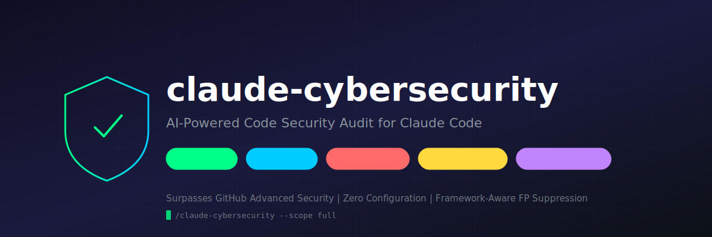
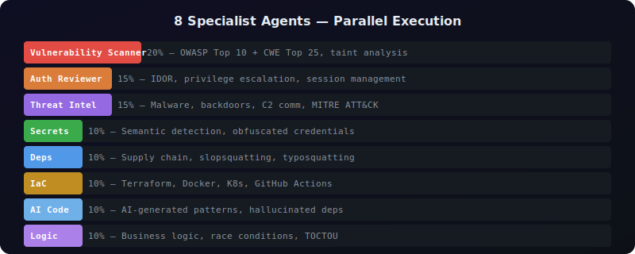
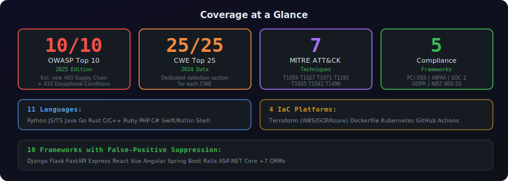
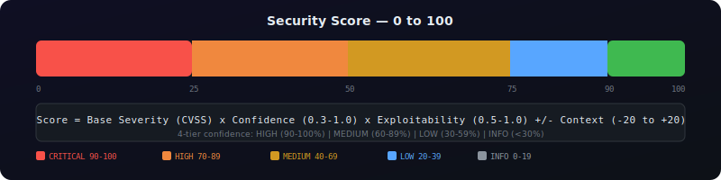
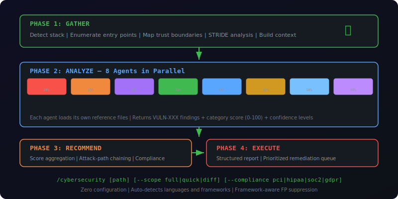

<p align="center">
  
</p>

<p align="center">
  <a href="https://github.com/AgriciDaniel/claude-cybersecurity/blob/main/LICENSE"></a>
  
  
  
  
  
</p>

---

**The most comprehensive AI-powered cybersecurity code review skill for Claude Code.** Spawns 8 parallel specialist agents to audit your codebase across vulnerability detection, authorization verification, secret scanning, supply chain analysis, IaC security, threat intelligence (malware/C2/backdoor detection), AI-generated code patterns, and business logic flaws.

**Surpasses GitHub Advanced Security** by detecting what static tools architecturally cannot: missing security controls, business logic flaws, attack-path chaining, and obfuscated secrets — with zero configuration.

---

## Installation

### One-liner (recommended)

```bash
curl -fsSL https://raw.githubusercontent.com/AgriciDaniel/claude-cybersecurity/main/install.sh | bash
```

### Manual

```bash
git clone https://github.com/AgriciDaniel/claude-cybersecurity.git
cd claude-cybersecurity
bash install.sh
```

### Windows (PowerShell)

```powershell
irm https://raw.githubusercontent.com/AgriciDaniel/claude-cybersecurity/main/install.ps1 | iex
```

## Quick Start

```bash
# Full security audit of current project
/cybersecurity

# Quick scan (entry points + auth + secrets + deps only)
/cybersecurity --scope quick

# Review only changed files (PR review mode)
/cybersecurity --scope diff

# Deep dive into one dimension
/cybersecurity --focus threat

# With compliance mapping
/cybersecurity --compliance pci
```

## What It Does

<p align="center">
  
</p>

## Key Differentiators vs GitHub Advanced Security

| Capability | GHAS | This Skill |
|------------|------|-----------|
| Business logic flaw detection | No | Yes |
| Authorization enforcement verification | Basic | Context-aware |
| Race condition detection | Very limited | Concurrency pattern analysis |
| Languages supported | 12 | 16+ (any language) |
| IaC/Container/CI-CD scanning | No | Terraform, Docker, K8s, Actions |
| AI-generated code security | No | Specialized detection |
| Obfuscated secret detection (84.4% recall) | Regex only | Semantic understanding |
| Threat intelligence (malware/C2) | No | MITRE ATT&CK mapped |
| Framework-aware false-positive suppression | No | 10 frameworks |
| Cost | $49/committer/month | Free (with Claude Code) |

## Coverage

<p align="center">
  
</p>

## Scoring System

<p align="center">
  
</p>

## Architecture

<p align="center">
  
</p>

## File Structure

```
skills/cybersecurity/
├── SKILL.md                              (900 lines — orchestrator)
├── references/
│   ├── vulnerability-taxonomy.md         (25 CWE categories)
│   ├── scoring-rubric.md                 (formula + confidence system)
│   ├── threat-intelligence.md            (MITRE ATT&CK patterns)
│   ├── compliance-matrix.md              (5 frameworks)
│   ├── false-positive-suppression.md     (10 frameworks)
│   ├── semgrep-patterns.md              (8 detection patterns)
│   ├── report-template.md               (output format + worked example)
│   ├── language-patterns/               (11 files)
│   └── iac-patterns/                    (4 files)
```

**Total: 23 files, 5,350 lines of security knowledge.**

## Requirements

- [Claude Code](https://claude.ai/code) (CLI, Desktop, or IDE extension)
- No other dependencies — zero configuration, works immediately

## Uninstall

```bash
curl -fsSL https://raw.githubusercontent.com/AgriciDaniel/claude-cybersecurity/main/uninstall.sh | bash
```

Or manually:
```bash
rm -rf ~/.claude/skills/cybersecurity
```

## Related Projects

- [claude-seo](https://github.com/AgriciDaniel/claude-seo) — Comprehensive SEO analysis
- [claude-blog](https://github.com/AgriciDaniel/claude-blog) — Full-lifecycle blog engine
- [claude-ads](https://github.com/AgriciDaniel/claude-ads) — Paid advertising audit

## License

[MIT](LICENSE) - AgriciDaniel 2026
